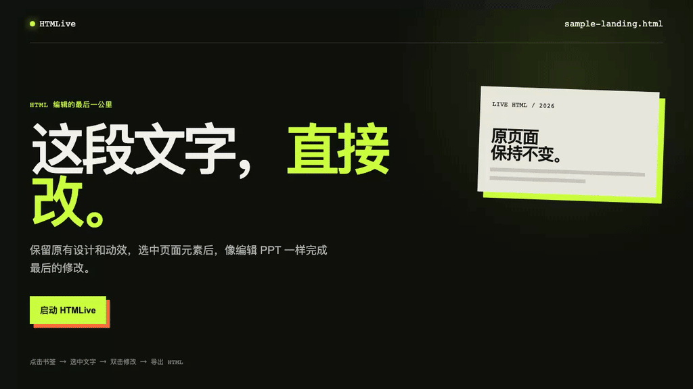

# HTMLive

> **Edit living HTML, instantly.** Make the last visual adjustment to an existing HTML page without regenerating it.

<p align="center">
  <a href="https://genni613.github.io/htmlive/"><strong>Install HTMLive</strong></a>
  &nbsp;·&nbsp;
  <a href="#quick-start">Quick start</a>
  &nbsp;·&nbsp;
  <a href="#limitations">Limitations</a>
  &nbsp;·&nbsp;
  <a href="#中文说明">中文</a>
</p>



## What is HTMLive?

HTMLive is a browser bookmarklet for editing an already-open HTML page. Keep its existing CSS, JavaScript, and motion intact while you select an element, edit text or styling, move or resize a component, then export an updated standalone HTML file.

It is made for the final mile of a page generated by AI, handed over by a teammate, or sent by a client—when the page is almost right and you only need a few precise visual changes.

## Why HTMLive?

Small changes to an AI-generated page can mean another prompt, another generation, and another review to make sure nothing you liked was changed by accident. HTMLive works **on the original page** instead: see the element, select it, make the adjustment, and export.

| Instead of | With HTMLive |
| --- | --- |
| Describe a small change in a new AI conversation | Select the original element and change it directly |
| Find the corresponding HTML and CSS | Edit text and styling visually |
| Move the page into another builder and lose motion | Keep the page's existing CSS, scripts, and animation |

## Quick start

1. Open the [HTMLive install page](https://genni613.github.io/htmlive/).
2. Drag the **HTMLive** button to your browser bookmarks bar.
3. Open the HTML page you want to adjust and click the bookmark.
4. Select an element and enter edit mode. Double-click text to edit it; use `⠿` to move it and `↘` to resize it.
5. Choose **Export HTML** to save a standalone edited file.

> The bookmark embeds the current editor when you drag it. After an HTMLive update, refresh the install page and drag the button again.

## Features

- Visual element selection, multi-selection, and parent/child navigation
- Direct text editing with a double-click
- Component movement and resize handles
- Text color, font-size, and font-family controls
- Undo/redo for direct edits, plus per-change undo for AI edits
- Optional AI chat preview with an OpenAI-compatible endpoint
- Export the edited DOM as a standalone HTML file
- No build step or application backend—the editor runs in the page

## Limitations

HTMLive is a finishing tool, not a full website builder.

- It works best for a single existing HTML page whose copy, style, or a few component positions need adjustment.
- It preserves the page's existing CSS, JavaScript, and animations where possible. Complex multi-page flows, restricted iframes, and browser security constraints cannot always be edited.
- A bookmarklet cannot silently overwrite arbitrary local files. Browsers with the File System Access API show a Save As dialog; other browsers download an `-edited.html` file.

## Local development

```bash
python3 -m http.server 4173 --bind 127.0.0.1
```

Open `http://127.0.0.1:4173/index.html`, then drag the generated bookmarklet to your bookmarks bar.

## Project structure

```text
index.html                    GitHub Pages install page
assets/editor.js              In-page selection, editing, AI, history, and export logic
assets/editor.css             Editor UI styles
docs/images/htmlive-hero.gif  README product demo
```

## Acknowledgements

Inspired by [oil-oil/selector](https://github.com/oil-oil/selector).

---

## 中文说明

> **直接编辑现有 HTML。** 保留网页原有的样式、脚本和动效，像编辑 PPT 一样完成最后一公里的修改。

<p align="center">
  <a href="https://genni613.github.io/htmlive/"><strong>在线安装 HTMLive</strong></a>
  &nbsp;·&nbsp;
  <a href="#30-秒上手">30 秒上手</a>
  &nbsp;·&nbsp;
  <a href="#适用边界">适用边界</a>
  &nbsp;·&nbsp;
  <a href="#htmlive">English</a>
</p>

### 这是什么

HTMLive 是一个浏览器书签工具（bookmarklet）。当你收到一份已经做好的 HTML 页面——无论来自 AI、同事还是客户——不用重新提示 AI，也不用先钻进代码：打开页面，点击 HTMLive，直接选中、编辑、移动和微调元素，最后导出新的独立 HTML。

它尤其适合这样的最后修改：

- “这个标题改短一点、字号小一点。”
- “把这张卡片往右挪一些。”
- “页面效果已经对了，只想改两处文案。”

### 为什么是 HTMLive

AI 可以很快生成一份漂亮的页面，但一个小的视觉调整常常意味着：重新描述需求、等待生成、再检查原本满意的内容有没有被误改。

HTMLive 不重新生成页面，而是在**原页面上修订**。已有的 CSS、JavaScript 和动效仍留在页面里；你改完后直接导出，继续交付或迭代。

| 原来的路径 | HTMLive |
| --- | --- |
| 再开一轮 AI 对话，反复描述要改什么 | 打开原页面，点选后直接修改 |
| 需要找到对应的 HTML / CSS | 所见即所得地编辑文字和样式 |
| 转进别的搭建器，可能丢掉动效 | 保留原页面的 CSS、脚本和动效 |

### 30 秒上手

1. 打开 [HTMLive 安装页](https://genni613.github.io/htmlive/)。
2. 将 **HTMLive** 按钮拖到浏览器书签栏。
3. 打开需要修改的 HTML 页面，点击书签。
4. 点击元素后进入编辑模式：双击文字即可编辑；用 `⠿` 拖动元素、用 `↘` 调整大小。
5. 点击 **导出 HTML**，保存修改后的独立文件。

> 每次更新 HTMLive 后，请刷新安装页并重新拖一次书签，以便书签带上最新版本的编辑器。

### 主要能力

- 视觉化点选组件，支持多选以及父/子元素导航
- 双击文字直接编辑
- 拖动、调整元素尺寸
- 调整文字颜色、字号与字体
- 直接操作的撤销 / 重做；AI 操作可逐次撤销
- 可选的 OpenAI-compatible AI 指令预览
- 导出为独立 HTML 文件
- 无构建步骤、无应用后端：编辑器直接在当前页面运行

### 适用边界

HTMLive 是“完成最后修改”的工具，不是完整的网站构建器：

- 最适合已有布局和动效、只需编辑文案、样式或少量组件位置的单页 HTML。
- 它会尽力保留原页面现有的 CSS、JavaScript 和动画；复杂的跨页面流程、受限 iframe 或浏览器安全策略下的内容，不保证都能编辑。
- 书签工具无法静默覆盖任意本地文件。支持 File System Access API 的浏览器会打开“另存为”；其他浏览器会下载一个 `-edited.html` 文件。
